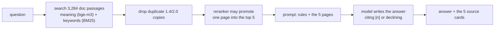

# sqlalchemy-upgrade-agent

**Ask why your code broke after upgrading SQLAlchemy 1.4 → 2.0. Get an answer written only from the
SQLAlchemy documentation, with every claim linked to the page it came from.**

**Try it:** https://virajvaghasia--sqlalchemy-upgrade-agent.modal.run — paste an error or a line of 1.4
code. The first question after the page has been idle takes about a minute while it wakes up.


*A real answer from the live page, 2026-09-22, to "query(User).get(1) warns LegacyAPIWarning, where
did get move to". Every claim carries the number of the page it came from; the list on the right
is the five pages the model was given, in order, with the one it used marked **cited**. The hosted
page is answered by `nemotron-3-ultra-550b` and says so under every answer.*

**When the pages it finds do not answer the question, it says so instead of guessing.** That is the
behaviour the whole project is built around, and it is the hard part — a model will always produce
something.


*The same page asked "How long will SQLAlchemy 1.4 be supported?", one of the nine questions the
test set marks as having no answer in these documents (live, 2026-09-22). It declined, said what it
looked for, and still listed the pages so you can check it. The note below the status is honest about the cost:
**19 of its 52 declines on the test set had the right page in hand.***

**It also lists what breaks.** The page carries an index of the 23 changes in
[`deliverables/BREAKAGES.md`](deliverables/BREAKAGES.md), each with the 1.4 call and the exception
SQLAlchemy 2.0.51 actually raised. Picking one asks the tool about it. The index is generated from
that file, and a test fails if the page's copy ever differs from it.


<details>
<summary>On a phone</summary>


</details>

## How it works



Nothing is trained. The model is given five pages and told to answer from them only. The live demo writes
with `nvidia/nemotron-3-ultra-550b-a55b`; the system is measured on the free local model `qwen2.5-coder:7b`,
and both are reported below.

## What is measured

Every number comes from a 100-question golden set **checked by hand**: 50 written in this repo (from the
migration guide and from breakages measured on real 2.0) and 50 real questions found on Stack Overflow and
GitHub. 9 have no answer in the docs, on purpose.

| measure | result |
|---|---|
| right page among the five shown (retrieval) | **64%** of 91 answerable, ±9.7 points; was 49% before the retrieval improvements |
| right page shown **and** answered, local `qwen2.5-coder:7b` | **0.42** (lab GPU) / 0.43 (Mac), measured before the citation fix shipped |
| same, hosted `nemotron-3-ultra-550b` (the demo) | **0.58**; 16 questions gained, 1 lost vs qwen |
| answers fully supported by their pages (same judge) | nemotron **91%**, qwen **81%**: level, p = 0.45 |
| nemotron's answers, main claim **run** on SQLAlchemy 2.0.51 | **47 of 51** checkable correct (92%) |
| invented answers on the 9 unanswerable questions | qwen **2**, nemotron **0** |
| send only qwen's declines to nemotron | 0.42 → at most **0.53**, $1.81 per 1000 questions *if paid* (all calls were free credits) |
| a pull request that removes the reranker | **blocked** by the CI quality gate, naming question `g017` (from committed rows, and on a GitHub runner) |

**What is not claimed:** that "supported" means correct (the judge called three wrong answers fully
supported); that the hosted model's numbers describe the local one; or anything measured on one
machine only.

## What went wrong, and how it was caught

**This is the part worth reading.** The numbers above are ordinary; the reason to trust them is that
this project has a written record of the times they were wrong, and none of it was found by reading.

| what was believed | what a measurement found | cost |
|---|---|---|
| The agent reasons worse than the one-shot pipeline | `agent._observation` truncated every page to **600 characters**. The median passage is **1,299**, and **2,755 of 3,284** exceed 600 — it was reading about half of what it was shown. Re-run whole: **0.25 → 0.43**, level with the pipeline | **every "the agent is worse" number retracted as a comparison** |
| Prompt `H` is a clear win — 9 fixed, 0 broken, p = 0.0039 | On a second machine: **6 fixed, 2 broken, p = 0.289**, and the lab reproduced that **to the item** five days apart | `H` **held**, on a pass/fail rule written before the data |
| Fencing untrusted text does nothing (11 obeyed on all three arms) | True of `qwen`. On the model the public demo actually serves: **16 → 10 → 10**, and **15 → 8 → 6** once a human had read the rows | a null restated as **a fact about one model**, not about a defense |
| Our obedience detector is a simple string compare, so it cannot be subtly wrong | `CANARY in answer` **counts a refusal as obedience** whenever the model names the attack it is refusing. The arm rejected for "opening two holes" had opened none | **fourth** detector to break *toward the arm under test* |
| Retrieval and generation both reproduce across machines | Retrieval reproduced **exactly** — same recall, same 17 misses, same ceiling. **Every generation number moved** | quote a range or name the machine |

**The pattern in the fourth row is the one I would ask about.** Each of those detectors was invisible
until the thing being measured *started working* — a prompt that finally cited its sources put `[2]`
in front of a refusal and the refusal scored as an answer; a defense that finally made the model
push back made it name the attacker's token, and naming it scored as obeying. **A detector written
against the failing case is untested against the succeeding one.**

**What was done about it, once, and then made routine:** pass/fail rules are written down
*before* the run and kept when they say no (`fence_both` is the best defense measured and **still did
not ship** — it missed a pre-registered bar by one attempt). Instruments are committed before their
first call. The answer key is hand-verified and a test stops the tooling stamping it. When the
canary broke, **nothing was re-scored by the people who found it** — a blank-verdict sheet shipped
with a test that refuses to fill it in, and all **95** attempts were read by a human before a single
number moved.

**Predictions are written down before each run and kept whether or not they hold.** In the security
phase: four written, **three wrong**, all four still on the page.

## Status

**All seven phases are closed.** Phase 0 measured what breaks between 1.4 and 2.0; Phase 1 built a
deliberately naive retrieval pipeline; Phase 2 built the hand-checked golden set; Phase 3 improved
retrieval (twin collapse, hybrid BM25, a seat-5 reranker); Phase 4 judged the answers rather than
the search; Phase 5 built a tool-using agent; Phase 6 put the demo online behind a CI quality gate;
Phase 7 measured prompt injection and shipped no defense, because none cleared the bar written
before the run.

**The citation fix shipped**: two answers in three used to cite nothing, and one sentence moved into
the user turn takes that to **1 in 10**, reproduced on both machines. It ships for that effect only;
the refusal gain it also showed did not reproduce. Pinned to SQLAlchemy **1.4.52**; every 2.0 claim
is verified against **2.0.51**.

## What is in this repository

| path | what it is |
|---|---|
| [`deliverables/BREAKAGES.md`](deliverables/BREAKAGES.md) | 23 changes that break 1.4 code, each with the 1.4 call, the exception SQLAlchemy 2.0.51 raised, and a fix that runs on 2.0.51 |
| [`deliverables/golden.json`](deliverables/golden.json) | the test set: **100 questions, 91 answerable, 9 unanswerable**, each with the documentation chunk that answers it. Half written here, half harvested from Stack Overflow and GitHub. `rag/score.py` refuses to score an item a human has not verified |
| [`deliverables/GOLDEN-FULLBAR-AUDIT.md`](deliverables/GOLDEN-FULLBAR-AUDIT.md) | the golden set audited three ways: chunks resolved, source page fetched live, claim executed on `sqlalchemy==2.0.51`. 100 PASS |
| [`deliverables/FAILURES.md`](deliverables/FAILURES.md) | the first 19 probe questions, where retrieval broke, and hand-written verdicts: **10 correct, 3 partial, 6 wrong** |
| [`deliverables/`](deliverables/) | also the saved runs every figure above is computed from, and the human-read review sheets |
| [`rag/`](rag/) | the system: corpus, chunking, embedding, hybrid search, reranking, the prompt, the judges, the agent, the CI gate and the demo backend |
| [`space/`](space/) | the demo page and its Modal deployment |
| [`experiments/`](experiments/) | the 1.4 app under test and the migration measurements |
| [`tools/`](tools/) | checks: every `# runnable` block reproduces, escalated answers run on 2.0.51, the demo page works in a browser |
| [`tests/`](tests/) | 607 tests |

---

## Quickstart

```bash
uv sync
uv run python -m experiments.sqlalchemy_1_4_vs_2_0.seed      # build issues.db
uv run python -m experiments.sqlalchemy_1_4_vs_2_0.check     # smoke-test the mappers
```

Everything below runs on 1.4 and changes nothing.

```bash
uv run python -m experiments.sqlalchemy_1_4_vs_2_0.explore     # relationships, live SQL
uv run python -m experiments.sqlalchemy_1_4_vs_2_0.states      # session runtime, N+1
uv run python -m experiments.sqlalchemy_1_4_vs_2_0.migration   # the 2.0 mechanics
uv run python -m experiments.sqlalchemy_1_4_vs_2_0.sweep       # 2.0 warnings, every module
uv run python -m experiments.sqlalchemy_1_4_vs_2_0.candidates  # patterns worth testing
```

To see what **real 2.0** does — without upgrading anything. `uv` builds a throwaway
environment while `pyproject.toml` stays pinned to 1.4:

```bash
uv run --no-project --with 'sqlalchemy==2.0.51' \
    python -m experiments.sqlalchemy_1_4_vs_2_0.verify_2_0
```

Phase 1 starts by fetching the retrieval corpus — 270 `.rst` files from the two pinned
SQLAlchemy release tags. It is not committed; this rebuilds it, and `corpus/MANIFEST.json`
records where every file came from and which release it documents.

```bash
uv run python -m rag.corpus            # fetch if absent, then report
uv run python -m rag.corpus --check    # re-hash every file against the manifest
uv run python -m rag.chunk             # cut it into 3284 retrievable chunks
uv run python -m rag.chunk --sample 10 # print ten at random to eyeball

uv sync --extra embed                  # torch + sentence-transformers (big; not in the image)
uv run python -m rag.embed             # 3284 x 1024 vectors -> corpus/embeddings.npy
docker compose up -d qdrant
uv run python -m rag.index             # load them into Qdrant
uv run python -m rag.index --search "why can't I call engine.execute any more?"
uv run python -m rag.ask "why can't I call engine.execute any more?"   # answer + sources
uv run python -m rag.probe             # 19 probe questions -> deliverables/FAILURES.md
uv run python -m rag.compare_embedders # BGE-M3 vs a 25x smaller model, on retrieval
```

---

## Repository layout

```
README.md              this file
docs/images/           screenshots of the deployed page, used by this file
deliverables/          the measured outputs: breakages, the golden set, audits, saved runs
experiments/           the code under study: the 1.4 app and the measurement harness
rag/                   retrieval, generation, the judges, the agent, the CI gate
tools/                 check_runnable.py — every `# runnable` block, verified; check_*.py — answers run on 2.0.51, the demo page in a browser
space/                 the demo: web.py + static/, modal_app.py (Modal host), app.py (older Gradio), pins, build script
corpus/                MANIFEST.json + CHUNK_STATS.json. raw/ and chunks.jsonl are generated
tests/                 607 tests
.github/workflows/     CI — tests, the 2.0 evidence, the image; gate.yml blocks a PR that loses a golden answer
```

### How to read a code block

Every fenced block carries one of three labels, and the contract differs:

| label | contract |
|---|---|
| `# runnable` | paste the named command and you get **exactly this text** — folding, wrapping and annotations are all done by the script, never by hand |
| `# summary of` | real output from the named command, abridged by hand because the raw form is unreadable. Numbers measured, layout not a paste |
| `# illustration` | a fragment or a sketch. Not something to run |

---

## The code

One package, `experiments/sqlalchemy_1_4_vs_2_0/`. Three roles.

### The app under test

Deliberately written in 1.4 style, with known 2.0 problems left in place.

| module | what it is |
|---|---|
| `models.py` | six mapped classes covering every relationship pattern — 1:M, M:M, association object, self-referential |
| `seed.py` | 200 issues from a fixed random seed, so every measured count is reproducible |
| `app.py` | the query layer: `Query.get()`, `engine.execute("…")`, an unoptimised N+1 |
| `check.py` | smoke test — forces mapper configuration so a broken relationship fails here, not at runtime |

### Tests

```
# runnable: uv run pytest --collect-only 2>&1 | grep -E 'collected'
607 tests collected in 20.73s
```

Ten need local setup and skip without it: five need Qdrant running, and five need the generated
corpus (`corpus/chunks.jsonl`). With both, 607 pass; without Qdrant, 602 pass and 5 skip; on a
fresh clone with neither, 597 pass and 10 skip. The block counts what is *collected* because that does not depend on
what happens to be running.

They pin what the project claims, not what SQLAlchemy does: the seeded row counts,
the six-mapped-classes/eight-tables split, that seeding twice produces byte-identical data, and
the `is_seeded` guard that stops the container's startup seed dropping a populated Postgres
volume. Each was mutation-checked — break the thing it describes and it fails.

`tests/test_corpus.py` pins the corpus decision the same way: that only one file was
taken out of `changelog/`, that no dialect pages got in, and that `BREAKAGES.md` stayed out so it
can still serve as the golden set's answer key.

### Measurement scripts

Each prints what the library actually does. Nothing in these asserts a number it didn't measure.

| module | shows |
|---|---|
| `explore.py` | every relationship pattern, with the SQL it emits |
| `states.py` | object states, the identity map, expiry, lazy vs `selectinload` vs `joinedload` |
| `migration.py` | nine sections: `query()` vs `select()`, the Result API, autobegin, `future=True`, `.unique()`, the measured N+1, `cascade_backrefs`, and what each tool misses |

### Migration tooling

| module | what it answers |
|---|---|
| `sweep.py` | *what does 2.0 object to across the whole project?* — runs the warning sweep on every module, then collapses occurrences into distinct problems |
| `patterns.py` | the shared list of 1.4 patterns under test. Imported by the two below so a prediction and its verification cannot drift apart |
| `candidates.py` | *which patterns are worth testing?* — classifies each by whether the sweep sees it, `future=True` sees it, or neither |
| `verify_2_0.py` | *what does real 2.0 actually do?* — runs the same patterns on 2.0.51 and reports the real error. `--stubs` emits the `deliverables/BREAKAGES.md` skeleton |

---

## Three findings worth knowing before you read anything else

**A green 1.4 test suite is not evidence about 2.0.** The 2.0 warnings are off by default —
`app.py` emits 1 normally and 5 with the flag, and both warnings marking real breakages are in
the hidden four.

```
# runnable: SQLALCHEMY_WARN_20=1 uv run python -m experiments.sqlalchemy_1_4_vs_2_0.sweep \
#             2>&1 | grep 'distinct,'
  RemovedIn20Warning  —  4 distinct, 29 occurrences
  MovedIn20Warning  —  1 distinct, 6 occurrences
  LegacyAPIWarning  —  1 distinct, 4 occurrences
```

**Neither migration tool is the inventory.** The warning sweep misses patterns that raise
without ever warning; `future=True` misses construction-time removals it never evaluates. Each
tool misses a different subset, and one pattern is called *safe* by both and still fails.

```
# runnable: uv run --no-project --with 'sqlalchemy==2.0.51' \
#             python -m experiments.sqlalchemy_1_4_vs_2_0.verify_2_0 2>&1 \
#             | grep 'patterns FAIL'
  22 of 24 patterns FAIL on 2.0.51
```

**The most dangerous breakage raises nothing.** Under 2.0, an object attached by the
many-to-one side of a relationship (`comment.issue = issue`) is never enrolled in the session —
the `INSERT` silently never runs. Applied to this repo's own seed, every comment and every
assignment disappears while the seed still reports success.

```
# runnable: the same verify_2_0 command as above, final section
  attached with project.issues.append(...)  -> in database: True
  attached with issue.project = project     -> in database: False
  rows in issues: 1   titles: ['attached by append']
```

Two objects, one line of code different, and only one of them exists afterwards. **No exception
is raised** — which is why a passing test suite says nothing about it.

---

## Conventions

| thing | convention | here |
|---|---|---|
| repo / folder / GitHub | `kebab-case`, all identical | `sqlalchemy-upgrade-agent` |
| Python packages | `snake_case` — hyphens are illegal in imports | `sqlalchemy_1_4_vs_2_0` |
| root docs | `SCREAMING_CASE.md` | `deliverables/BREAKAGES.md` |
| branches | `phase-N/short-topic` | `phase-0/breakages-and-audit` |
| commits | [Conventional Commits](https://www.conventionalcommits.org/) | `feat:`, `fix:`, `docs:` |
| Compose project + built image | one name, **declared** so nothing is inferred | `sqlalchemy-upgrade-agent` |
| Compose services | one lowercase word — it becomes a hostname | `app`, `db` |
| Postgres role / database | lowercase, no hyphens (they force quoting in SQL) | `app` / `issues` |

The Docker rows are not decoration. With `build:` and no `image:`, Compose invents a name from
project and service — a second image, built from the same Dockerfile, drifting apart from
anything you tagged by hand. That cost an hour once.

`issues.db` is generated, not committed — run `seed.py` to rebuild it identically.
