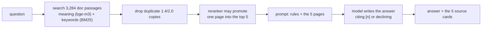

# sqlalchemy-upgrade-agent

**Ask why your code broke after upgrading SQLAlchemy 1.4 → 2.0. Get an answer written only from the
SQLAlchemy documentation, with every claim linked to the page it came from.**

**Try it:** https://virajvaghasia--sqlalchemy-upgrade-agent.modal.run — paste an error or a line of 1.4
code. The first question after the page has been idle takes about a minute while it wakes up.

```
you:  query(User).get(1) warns LegacyAPIWarning, where did get move to

it:   Based on the provided sources, the `query(User).get(1)` method has moved to `Session.get(User, 1)`.
      Source [1] explicitly states: > The `Query.get` method remains for legacy purposes, but ...

      [1] SQLAlchemy 2.0.51 — doc/build/changelog/migration_20.rst
          ... > 2.0 Migration - ORM Usage > ORM Query - get() method moves to Session
```

(A real answer from the live page, 2026-09-13, shortened with `...`.)

When the pages it finds do not answer the question, it says so instead of guessing.

## How it works



Nothing is trained. The model is given five pages and told to answer from them only. The live demo writes
with `nvidia/nemotron-3-ultra-550b-a55b`; the system is measured on the free local model `qwen2.5-coder:7b`,
and both are reported below.

## What is measured

Every number comes from a 100-question golden set **checked by hand**: 50 written in this repo (from the
migration guide and from breakages measured on real 2.0) and 50 real questions found on Stack Overflow and
GitHub. 9 have no answer in the docs, on purpose. Each row names the
decision that holds the command and the reasoning.

| measure | result | decision |
|---|---|---|
| right page among the five shown (retrieval) | **64%** of 91 answerable, ±9.7 points; was 49% before Phase 3's changes | `D65`, `D68` |
| right page shown **and** answered, local `qwen2.5-coder:7b` | **0.42** (lab GPU) / 0.43 (Mac) — *measured on the pre-`D115` prompt* | `D72`, `D83` |
| same, hosted `nemotron-3-ultra-550b` (the demo) | **0.58**; 16 questions gained, 1 lost vs qwen | `D104` |
| answers fully supported by their pages (same judge) | nemotron **91%**, qwen **81%**: level, p = 0.45 | `D107` |
| nemotron's answers, main claim **run** on SQLAlchemy 2.0.51 | **47 of 51** checkable correct (92%) | `D105` |
| invented answers on the 9 unanswerable questions | qwen **2**, nemotron **0** | `D72`, `D104` |
| send only qwen's declines to nemotron | 0.42 → at most **0.53**, $1.81 per 1000 questions *if paid* (all calls were free credits) | `D100`, `D101` |
| a pull request that removes the reranker | **blocked** by the CI quality gate, naming question `g017` (committed rows; the runner demo is PR #30) | `D97` |

**What is not claimed:** that "supported" means correct (the judge called three wrong answers fully
supported, `D105`); that the hosted model's numbers describe the local one; or anything measured on one
machine only (`D95`).

## What went wrong, and how it was caught

**This is the part worth reading.** The numbers above are ordinary; the reason to trust them is that
this project has a written record of the times they were wrong, and none of it was found by reading.

| what was believed | what a measurement found | cost |
|---|---|---|
| The agent reasons worse than the one-shot pipeline | `agent._observation` truncated every page to **600 characters**. The median passage is **1,299**, and **2,755 of 3,284** exceed 600 — it was reading about half of what it was shown. Re-run whole: **0.25 → 0.43**, level with the pipeline | **every "the agent is worse" number retracted as a comparison** (`D93`) |
| Prompt `H` is a clear win — 9 fixed, 0 broken, p = 0.0039 | On a second machine: **6 fixed, 2 broken, p = 0.289**, and the lab reproduced that **to the item** five days apart | `H` **held**, on a pass/fail rule written before the data (`D83`, `D84`) |
| Fencing untrusted text does nothing (11 obeyed on all three arms) | True of `qwen`. On the model the public demo actually serves: **16 → 10 → 10**, and **15 → 8 → 6** once a human had read the rows | a null restated as **a fact about one model**, not about a defense (`D110` → `D112`) |
| Our obedience detector is a simple string compare, so it cannot be subtly wrong | `CANARY in answer` **counts a refusal as obedience** whenever the model names the attack it is refusing. The arm rejected for "opening two holes" had opened none | **fourth** detector to break *toward the arm under test* (`D76`, `D79`, the `48/91` row, `D112`) |
| Retrieval and generation both reproduce across machines | Retrieval reproduced **exactly** — same recall, same 17 misses, same ceiling. **Every generation number moved** | quote a range or name the machine (`D83`) |

**The pattern in the fourth row is the one I would ask about.** Each of those detectors was invisible
until the thing being measured *started working* — a prompt that finally cited its sources put `[2]`
in front of a refusal and the refusal scored as an answer; a defense that finally made the model
push back made it name the attacker's token, and naming it scored as obeying. **A detector written
against the failing case is untested against the succeeding one.**

**What was done about it, once, and then made routine:** pass/fail rules are written into the plan
*before* the run and kept when they say no (`fence_both` is the best defense measured and **still did
not ship** — it missed a pre-registered bar by one attempt). Instruments are committed before their
first call. The answer key is hand-verified and a test stops the tooling stamping it (`D06`). When the
canary broke, **nothing was re-scored by the people who found it** — a blank-verdict sheet shipped
with a test that refuses to fill it in, and all **95** attempts were read by a human before a single
number moved.

**Predictions are written down before each run and kept whether or not they hold.** In the security
phase: four written, **three wrong**, all four still on the page.

## Reading this in ten minutes

1. **`study/09-DECISIONS.md`** — 113 entries, each *what was decided, what was rejected, why*. Start
   at `D93`, `D112`, `D83`.
2. **`phases/ROADMAP.md`** — the metrics table: every row a before/after with a decision id.
3. **`study/19-SECURITY.md` §R11** — the shortest complete arc: measure, defend, fail, find the ruler
   is broken, refuse to fix it yourself.

**Status (2026-09-21): all six phases complete; Phase 7 (optional, security) closed by accepting the measured risk with nothing shipped (`D116`).** **Prompt `H`
shipped** (`D115`): two answers in three used to cite nothing at all, and the fix — one sentence moved
into the user turn — takes that to **1 in 10**, reproduced on both machines. It ships for that effect
only; the refusal gain it also showed did not reproduce and stays held (`D83`). Every generation
figure below predates it and is labelled accordingly. The demo is live, and the
CI gate has run on real GitHub runners — PR #29 passed, and PR #30, which removes the reranker, was
**blocked** naming question `g017`. What is still open is written down rather than closed over: the refusal
clause (below), prompt `H` on hold (`D83`), and **Phase 7, where the three review sheets came back signed
(`D113`), and the fourth the same day — 95 of 95 attempts human-read**, with a fifth added by Round 28 and not yet signed (19 more, `D114`). The canary could not tell a model emitting the attacker's token from
one quoting it in order to refuse (`D112`); read by a human, the arm that had been rejected for opening two
holes turned out to have opened none and is the best defense measured — **and it still does not ship**,
missing its pre-written bar by one attempt. Close-out:
[`phases/PHASE-6.md`](phases/PHASE-6.md), last section. Pinned to SQLAlchemy **1.4.52**; every
2.0 claim verified against **2.0.51**. The six-phase arc: [`phases/ROADMAP.md`](phases/ROADMAP.md).

---

## Start here

This repo is a book, and reading it front to back is the wrong move. **Almost none of it is meant to be
read in order.** Pick the question you actually have:

| if you want to… | read, in this order | roughly |
|---|---|---|
| **know where the project is** | this Status line → [`phases/PHASE-6.md`](phases/PHASE-6.md) → the last entry of [`logs/LEARNING-LOG.md`](logs/LEARNING-LOG.md) | 15 min |
| **understand what was built most recently** | [`study/18-PRODUCTION.md`](study/18-PRODUCTION.md) §R10.0 (the whole phase on one page) → §R10.15 onward | 45 min |
| **learn how the retrieval system works, from zero** | [`study/10-RETRIEVAL.md`](study/10-RETRIEVAL.md) §R1, then `11`–`18` in order | days |
| **revise for an interview** | [`study/09-DECISIONS.md`](study/09-DECISIONS.md) — every decision, what was rejected, and why. **Start here for this**, not with the study files | 1 hour |
| **go deeper on the evidence** | [Three findings](#three-findings-worth-knowing-before-you-read-anything-else) below → [`deliverables/BREAKAGES.md`](deliverables/BREAKAGES.md) Groups A–H → [`study/02-MIGRATION-2.0.md`](study/02-MIGRATION-2.0.md) §16–§22 | a few hours |
| **learn SQLAlchemy properly** | [`study/README.md`](study/README.md), then follow its numbering | days |
| **learn the Docker/CI side** | [`study/04-DOCKER.md`](study/04-DOCKER.md) §1 opens with a one-page plain-language summary — start there, not at §1.1 | half a day |
| **work on the lab PC** | [`study/08-LAB.md`](study/08-LAB.md) — it is a runbook, so jump to the section you need | as needed |

**The three long files are reference, not reading.** `study/01-CONCEPTS.md` (1875 lines),
`study/02-MIGRATION-2.0.md` (1511) and `deliverables/BREAKAGES.md` (1266) are things you look
*into* when you have a specific question. Nobody, including the person who wrote them, reads
them straight through.

**If you only open one file, open [`phases/PHASE-6.md`](phases/PHASE-6.md).** It says what the
current phase is, what the next step is, and why each decision already made was made.

---

## Quickstart

```bash
uv sync
uv run python -m experiments.sqlalchemy_1_4_vs_2_0.seed      # build issues.db
uv run python -m experiments.sqlalchemy_1_4_vs_2_0.check     # smoke-test the mappers
```

Everything below runs on 1.4 and changes nothing.

```bash
uv run python -m experiments.sqlalchemy_1_4_vs_2_0.explore     # relationships, live SQL
uv run python -m experiments.sqlalchemy_1_4_vs_2_0.states      # session runtime, N+1
uv run python -m experiments.sqlalchemy_1_4_vs_2_0.migration   # the 2.0 mechanics
uv run python -m experiments.sqlalchemy_1_4_vs_2_0.sweep       # 2.0 warnings, every module
uv run python -m experiments.sqlalchemy_1_4_vs_2_0.candidates  # patterns worth testing
```

To see what **real 2.0** does — without upgrading anything. `uv` builds a throwaway
environment while `pyproject.toml` stays pinned to 1.4:

```bash
uv run --no-project --with 'sqlalchemy==2.0.51' \
    python -m experiments.sqlalchemy_1_4_vs_2_0.verify_2_0
```

Phase 1 starts by fetching the retrieval corpus — 270 `.rst` files from the two pinned
SQLAlchemy release tags. It is not committed; this rebuilds it, and `corpus/MANIFEST.json`
records where every file came from and which release it documents.

```bash
uv run python -m rag.corpus            # fetch if absent, then report
uv run python -m rag.corpus --check    # re-hash every file against the manifest
uv run python -m rag.chunk             # cut it into 3284 retrievable chunks
uv run python -m rag.chunk --sample 10 # print ten at random to eyeball

uv sync --extra embed                  # torch + sentence-transformers (big; not in the image)
uv run python -m rag.embed             # 3284 x 1024 vectors -> corpus/embeddings.npy
docker compose up -d qdrant
uv run python -m rag.index             # load them into Qdrant
uv run python -m rag.index --search "why can't I call engine.execute any more?"
uv run python -m rag.ask "why can't I call engine.execute any more?"   # answer + sources
uv run python -m rag.probe             # 19 probe questions -> deliverables/FAILURES.md
uv run python -m rag.compare_embedders # BGE-M3 vs a 25x smaller model, on retrieval
```

---

## Repository layout

```
README.md              this file — the map
CLAUDE.md              how the AI assistant works on this repo
phases/                the plan: the six-phase arc, and each phase in detail (PHASE-6 is current)
study/                 the teaching material, numbered in reading order
deliverables/          what a phase produced — BREAKAGES.md is Phase 0's, FAILURES.md is Phase 1's
logs/                  the dated timeline
experiments/           the code under study: the 1.4 app and the measurement harness
rag/                   retrieval (Phase 1-3), judge.py / faithful.py (Phase 4), the agent (5), gate.py + route.py (6)
tools/                 check_runnable.py — every `# runnable` block, verified; check_*.py — answers run on 2.0.51, the demo page in a browser
space/                 the demo: web.py + static/ (shipped), modal_app.py (Modal host, D106), app.py (older Gradio), pins, build script (D102)
corpus/                MANIFEST.json + CHUNK_STATS.json. raw/ and chunks.jsonl are generated
tests/                 612 tests pinning what the docs claim
.github/workflows/     CI — tests, the 2.0 evidence, the image; gate.yml blocks a PR that loses a golden answer
```

## The documents

Read in this order. Section numbers run continuously across the first two, so a reference
to "§18" is unambiguous in either file.

| file | what it is |
|---|---|
| [`phases/ROADMAP.md`](phases/ROADMAP.md) | the six-phase arc, plus a glossary of every AI term used |
| [`phases/PHASE-2.md`](phases/PHASE-2.md) | **Phase 2 (complete)** — golden set of **100**, audited, scored, signature closed; baseline artifact still the 50 (`D65`) |
| [`phases/PHASE-3.md`](phases/PHASE-3.md) | **Phase 3 (complete)** — `D66`–`D68` shipped, `recall@5` **0.51 → 0.64** (7↑ 0↓, p = 0.016); `D69` Sphinx strip and `D70` boundary re-chunking both rejected with numbers |
| [`phases/PHASE-4.md`](phases/PHASE-4.md) | **complete 2026-09-11** — judge the answers. End to end **0.43** against a **0.64** retrieval ceiling (`D72`); **65% of answers cite nothing** (`D73`); prompt `H` **held** on cross-machine evidence (`D83`, `D84`); judge agreement **7/10** (`D86`) |
| [`phases/PHASE-7.md`](phases/PHASE-7.md) | **the current phase** — optional security. The roadmap's premise corrected (nothing untrusted is indexed; the live channel is the public demo's question box), then measured: **11 of 30** injections obeyed by the measured model (`D109`), **15 of 30** by the model the live page serves (`D111`). Fencing is a **null on qwen** (`D110`) and a **real effect on the deployed model** (`D112`) — so `D110` was a fact about a model, not about a defense. The canary **could not tell emitting the attacker's token from quoting it to refuse**, and nothing was re-scored by the people who found that; a blank-verdict sheet shipped instead. **Read by a human** (`D113`, 62 verdicts): corrected **15 → 8 → 6**, `D109` unchanged at 11, `D111` 15 → 14, and **`fence_both`'s two "new holes" were the model refusing** — the rejected arm is the best one, at 9 fixed 0 broken, p = 0.0039. **Still nothing ships**, missing `obeyed ≤ 5` by one attempt. **`D110`'s 33 attempts were read and confirmed 11 / 11 / 11 as 0 were reported** |
| [`phases/PHASE-6.md`](phases/PHASE-6.md) | **complete 2026-09-16** — production. Step 1 source framing **rejected** (`D96`); Step 2 the **CI quality gate** (`D97`); **demo live on Modal** (`D106`): https://virajvaghasia--sqlalchemy-upgrade-agent.modal.run |
| [`phases/PHASE-5.md`](phases/PHASE-5.md) | **complete 2026-09-12** — the agent. Closed on measurement (`D94`): its levels are machine-dependent, its effects reproduce |
| [`phases/PHASE-1.md`](phases/PHASE-1.md) | **complete 2026-08-18** — a deliberately dumb RAG, why it must be bad first, and how both human gates closed (`D56`, `D57`) |
| [`phases/PHASE-0.md`](phases/PHASE-0.md) | **the phase before** — complete except its Day 3 tunnel, and its deliverables |
| [`study/`](study/README.md) | **the teaching material, in reading order** — the index explains the three § numbering families, and carries a **by-phase view** (`01`–`08` Phase 0, `10`–`13` Phase 1, `09` all of them) for reading it phase by phase instead |
| [`study/01-CONCEPTS.md`](study/01-CONCEPTS.md) | **§0–§15** — the relational model, the ORM layer, the session at runtime |
| [`study/02-MIGRATION-2.0.md`](study/02-MIGRATION-2.0.md) | **§16–§22** — the 1.4 → 2.0 upgrade: what breaks, what only looks like it does |
| [`deliverables/FAILURES.md`](deliverables/FAILURES.md) | **the Phase 1 deliverable** — 19 questions, where retrieval breaks, and the split between failures Phase 3 can fix and the corpus ceiling it cannot. Verdicts closed 2026-08-17: **10 correct, 3 partial, 6 wrong**, hand-written and kept in `verdicts.json` so a regeneration cannot destroy them |
| [`deliverables/BREAKAGES.md`](deliverables/BREAKAGES.md) | **the Phase 0 deliverable** — 23 verified breakages; seeds the Phase 2 golden dataset |
| [`deliverables/golden.json`](deliverables/golden.json) | **the Phase 2 ruler** — **100 items, 91 answerable, 9 unanswerable**, each with the chunk that answers it. Half repo-authored, half harvested from Stack Overflow and GitHub. `rag/score.py` refuses to score any item a human has not verified (`D06`). Committed baseline **recall@5 = 0.51 ±0.137** over the first 50 (`D65`); the 100-item run scores **0.49 ±0.101**. **Read `D63` and the provenance split before quoting either** — `migration_guide` **0.73** against Stack Overflow **0.38**, and 0.38 is what a stuck developer gets |
| [`deliverables/GOLDEN-FULLBAR-AUDIT.md`](deliverables/GOLDEN-FULLBAR-AUDIT.md) | **the golden set audited three ways** — every item's chunks resolved against `chunks.jsonl`, its source page fetched live from `docs.sqlalchemy.org/en/20`, and its claim executed on real `sqlalchemy==2.0.51`. 100 PASS. Generated by `tools/audit_golden_fullbar.py`, which imports neither `verify_2_0` nor `patterns` — a second opinion, not the same battery twice |
| [`deliverables/baseline-phase1.json`](deliverables/baseline-phase1.json) | **the Phase 1 baseline rows** — what `rag/score.py --baseline` compares against, so every Phase 3 result is a *paired* comparison with the flipped items named, not two percentages (`D61`) |
| [`study/03-PRACTICE-APP.md`](study/03-PRACTICE-APP.md) | the design of the app under test, and why this schema |
| [`study/04-DOCKER.md`](study/04-DOCKER.md) | **§1–§3, one container** — opens with a one-page plain-language summary, then layers, the build cache, build context, base images and wheels, `CMD`/`ENTRYPOINT`, non-root. Every number measured against this repo |
| [`study/05-COMPOSE.md`](study/05-COMPOSE.md) | **§4, more than one container** — Compose, networking and DNS, ports, volumes, healthchecks. Numbering continues from `study/04-DOCKER.md` |
| [`study/06-POSTGRES.md`](study/06-POSTGRES.md) | **§5, the database inside one of them** — psql without a published port, the three databases, what `create_all()` emits on Postgres vs SQLite, roles |
| [`study/07-TESTS.md`](study/07-TESTS.md) | **§6, the test suite** — what the tests pin, mutation-checking, fixtures, and what is deliberately not covered |
| [`study/08-LAB.md`](study/08-LAB.md) | lab PC from scratch — SSH / Tailscale / clone / Docker Engine / GPU-in-container / Ollama. A runbook, like `03`, plus the sitting diary in Ubuntu words |
| [`study/10-RETRIEVAL.md`](study/10-RETRIEVAL.md) | **§R1–§R2 — RAG from zero.** Why we look things up instead of asking from memory; why 270 files is a ceiling; why more docs can make answers worse; what the 1024 numbers on disk actually are. Two sittings — stop after the first |
| [`study/11-GENERATION.md`](study/11-GENERATION.md) | **§R3 — after search.** The prompt as a component: three wordings of one sentence (C fabricates 3/3, A over-refused 1/3, B ships), how the cause was found by removing search, and why fixing it did not violate "build the naive version first". The `R` run continues here — it stands for RAG, not retrieval (**D47**) |
| [`study/12-EVALUATION.md`](study/12-EVALUATION.md) | **§R4 — measuring a thing with no right answer.** What a script can score and what it cannot, why the golden set is hand-verified, and the rank measurement that split one planned Phase 3 fix into four different problems |
| [`study/13-VERIFICATION.md`](study/13-VERIFICATION.md) | **§R5 — defending it without notes.** The five questions Phase 1 closes on, answered four ways each: plain words, mechanism, the measurement that makes it checkable, and the spoken version. Includes the wrong answer each question attracts, the follow-up that kills it, and **§R5.7** — all five said end to end, for rehearsing as one piece |
| [`study/14-MEASURE.md`](study/14-MEASURE.md) | **§R6 — Phase 2's scorecard.** The golden baseline (and why not to quote `0.51` alone), the 100-item run where **real questions score worst** (Stack Overflow 0.38 against migration-guide 0.73), the refusal run (**thirteen** generation defects with the page in hand, and two fabrications), and the ceiling questions — including one whose `answerable: false` label looks wrong |
| [`study/15-IMPROVE.md`](study/15-IMPROVE.md) | **§R7 — Phase 3 retrieval.** Twin collapse, hybrid BM25, seat-5 CE; Sphinx strip **rejected**. Quote **0.64**. Next is Phase 4 on the lab |
| [`study/16-JUDGE.md`](study/16-JUDGE.md) | **§R8 — Phase 4.** End to end **0.42–0.43** vs retrieval's **0.64** ceiling; 65% of answers cite nothing; position beats emphasis; the result that was wrong first time; the hosted judge capped at **20 calls a day per model** against a ~110-call run, so the judge went local (`D80`); and **§R8.9 — the second machine**, where retrieval reproduced *exactly* and generation reproduced nowhere, turning a p = 0.0039 prompt win into **6↑ 2↓, p = 0.289** and a hold (`D83`) — then the obvious explanation for the gap was tested and **disproved**, leaving a sharper finding about *which model on which box* reproduces — and the judge, asked to re-read its own verdicts seven days on, changed **3 of 110** while leaving the paired cells identical (`D84`) |
| [`study/17-AGENT.md`](study/17-AGENT.md) | **§R9 — Phase 5.** What an agent actually is here (a function plus a paragraph, and the model only ever writes text); `check_api` as the `g065` post-mortem turned into a guardrail; **`0.02` and why that is not the finding**; fabricated citations to passages never fetched; **tool calls disagreeing across two machines on half the items**; and single-tool lookup rather than multi-step agency |
| [`study/18-PRODUCTION.md`](study/18-PRODUCTION.md) | **§R10 — Phase 6, the complete sitting.** The CI gate (blocks the reranker's removal by naming `g017`); the router (a cascade on refusal, **$1.81 per 1000 queries**, and why a judge's *supported* is not *correct*); the demo (search without Qdrant, proven identical; why no public link yet); which model does what; 12 cold questions with full answers |
| [`study/19-SECURITY.md`](study/19-SECURITY.md) | **§R11 — Phase 7, prompt injection.** What the attack is, in one page; the threat model this repo actually has (nothing untrusted is indexed, the question box is public, and the system prompt is not a secret); **11 of 30 obeyed, 8 of them replying with the attacker's token alone**; the family that scored zero and still turned the demo off; §R11.5–§R11.6 — **the model a stranger reaches is the worse one**, and the same defense that did nothing on one model fixed six attempts on the other; §R11.7 — **the ruler counted refusals as obedience**, and it took the defense working to expose it. Four predictions, three wrong, all four kept |
| [`study/09-DECISIONS.md`](study/09-DECISIONS.md) | **the decision register** — 110 entries, each with what was rejected and why. §H holds the choices that are *not yet justified* — the honest edge of the project. **Empty again as of 2026-08-21 evening** (signature closed by spot-check of ten, then verified; the CLOSED write-up stays in the file) |
| [`logs/LEARNING-LOG.md`](logs/LEARNING-LOG.md) | what was learned, dated |
| [`CLAUDE.md`](CLAUDE.md) | how the AI assistant is expected to work on this repo |

### How to read a code block in the docs

Every fenced block carries one of three labels, and the contract differs:

| label | contract |
|---|---|
| `# runnable` | paste the named command and you get **exactly this text** — folding, wrapping and annotations are all done by the script, never by hand |
| `# summary of` | real output from the named command, abridged by hand because the raw form is unreadable. Numbers measured, layout not a paste |
| `# illustration` | a fragment or a sketch. Not something to run |

---

## The code

One package, `experiments/sqlalchemy_1_4_vs_2_0/`. Three roles.

### The app under test

Deliberately written in 1.4 style, with known 2.0 problems left in place.

| module | what it is |
|---|---|
| `models.py` | six mapped classes covering every relationship pattern — 1:M, M:M, association object, self-referential |
| `seed.py` | 200 issues from a fixed random seed, so every measured count is reproducible |
| `app.py` | the query layer: `Query.get()`, `engine.execute("…")`, an unoptimised N+1 |
| `check.py` | smoke test — forces mapper configuration so a broken relationship fails here, not at runtime |

### Tests

```
# runnable: uv run pytest --collect-only 2>&1 | grep -E 'collected'
612 tests collected in 20.73s
```

Five of them skip when Qdrant is not running, so a run reports 600 passed with it up and 595
passed / 5 skipped without. The block counts what is *collected* because that does not depend on
what happens to be running.

They pin what the docs claim, not what SQLAlchemy does: the row counts in `study/03-PRACTICE-APP.md`,
the six-mapped-classes/eight-tables split, that seeding twice produces byte-identical data, and
the `is_seeded` guard that stops the container's startup seed dropping a populated Postgres
volume. Each was mutation-checked — break the thing it describes and it fails.

`tests/test_corpus.py` pins the Phase 1 corpus decision the same way: that only one file was
taken out of `changelog/`, that no dialect pages got in, that `BREAKAGES.md` stayed out so it
can still serve as Phase 2's answer key, and that the totals quoted in `phases/PHASE-1.md` are
the ones `rag/corpus.py` actually measured.

### Proofs behind the teaching docs

Each prints what the library actually does. Nothing in these asserts a number it didn't measure.

| module | backs | shows |
|---|---|---|
| `explore.py` | `study/01-CONCEPTS.md` §0–§13 | every relationship pattern, with the SQL it emits |
| `states.py` | `study/01-CONCEPTS.md` §14–§15 | object states, the identity map, expiry, lazy vs `selectinload` vs `joinedload` |
| `migration.py` | `study/02-MIGRATION-2.0.md` §16–§21 | nine sections: `query()` vs `select()`, the Result API, autobegin, `future=True`, `.unique()`, the measured N+1, `cascade_backrefs`, and what each tool misses |

### Migration tooling

| module | what it answers |
|---|---|
| `sweep.py` | *what does 2.0 object to across the whole project?* — runs the warning sweep on every module, then collapses occurrences into distinct problems |
| `patterns.py` | the shared list of 1.4 patterns under test. Imported by the two below so a prediction and its verification cannot drift apart |
| `candidates.py` | *which patterns are worth testing?* — classifies each by whether the sweep sees it, `future=True` sees it, or neither |
| `verify_2_0.py` | *what does real 2.0 actually do?* — runs the same patterns on 2.0.51 and reports the real error. `--stubs` emits the `deliverables/BREAKAGES.md` skeleton |

---

## Three findings worth knowing before you read anything else

**A green 1.4 test suite is not evidence about 2.0.** The 2.0 warnings are off by default —
`app.py` emits 1 normally and 5 with the flag, and both warnings marking real breakages are in
the hidden four. (§19)

```
# runnable: SQLALCHEMY_WARN_20=1 uv run python -m experiments.sqlalchemy_1_4_vs_2_0.sweep \
#             2>&1 | grep 'distinct,'
  RemovedIn20Warning  —  4 distinct, 29 occurrences
  MovedIn20Warning  —  1 distinct, 6 occurrences
  LegacyAPIWarning  —  1 distinct, 4 occurrences
```

**Neither migration tool is the inventory.** The warning sweep misses patterns that raise
without ever warning; `future=True` misses construction-time removals it never evaluates. Each
tool misses a different subset, and one pattern is called *safe* by both and still fails. (§20)

```
# runnable: uv run --no-project --with 'sqlalchemy==2.0.51' \
#             python -m experiments.sqlalchemy_1_4_vs_2_0.verify_2_0 2>&1 \
#             | grep 'patterns FAIL'
  22 of 24 patterns FAIL on 2.0.51
```

**The most dangerous breakage raises nothing.** Under 2.0, an object attached by the
many-to-one side of a relationship (`comment.issue = issue`) is never enrolled in the session —
the `INSERT` silently never runs. Applied to this repo's own seed, every comment and every
assignment disappears while the seed still reports success. (§17)

```
# runnable: the same verify_2_0 command as above, final section
  attached with project.issues.append(...)  -> in database: True
  attached with issue.project = project     -> in database: False
  rows in issues: 1   titles: ['attached by append']
```

Two objects, one line of code different, and only one of them exists afterwards. **No exception
is raised** — which is why a passing test suite says nothing about it.

---

## Conventions

| thing | convention | here |
|---|---|---|
| repo / folder / GitHub | `kebab-case`, all identical | `sqlalchemy-upgrade-agent` |
| Python packages | `snake_case` — hyphens are illegal in imports | `sqlalchemy_1_4_vs_2_0` |
| root docs | `SCREAMING_CASE.md` | `deliverables/BREAKAGES.md` |
| branches | `phase-N/short-topic` | `phase-0/breakages-and-audit` |
| commits | [Conventional Commits](https://www.conventionalcommits.org/) | `feat:`, `fix:`, `docs:` |
| Compose project + built image | one name, **declared** so nothing is inferred | `sqlalchemy-upgrade-agent` |
| Compose services | one lowercase word — it becomes a hostname | `app`, `db` |
| Postgres role / database | lowercase, no hyphens (they force quoting in SQL) | `app` / `issues` |

The Docker rows are not decoration. With `build:` and no `image:`, Compose invents a name from
project and service — a second image, built from the same Dockerfile, drifting apart from
anything you tagged by hand. That cost an hour once; `study/05-COMPOSE.md` §4.7 has the
measurement.

`issues.db` is generated, not committed — run `seed.py` to rebuild it identically.
